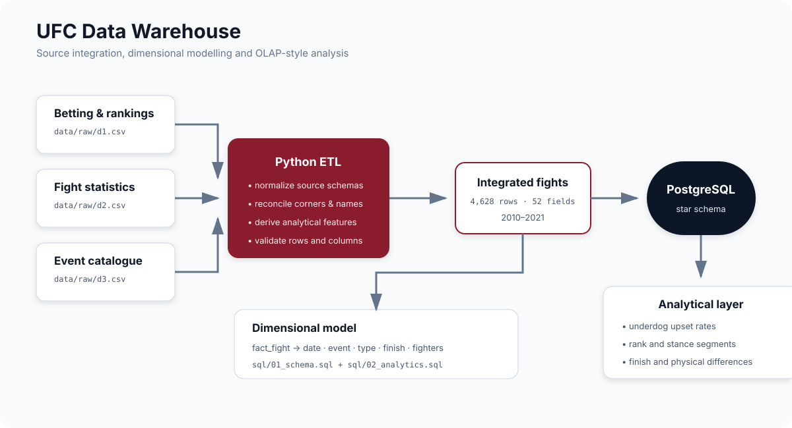

# UFC Data Warehouse

A data-engineering project that integrates UFC betting, ranking, event, and fight-statistics data into an analysis-ready dataset and a PostgreSQL dimensional warehouse.

  

## What this project demonstrates

- Multi-source ETL with schema normalization and temporal filtering.
- Automated reconciliation of swapped red/blue corners and fighter-name mismatches.
- Feature engineering for age bands, ranking status, championship status, and physical differences.
- A PostgreSQL fact-and-dimension model for OLAP-style queries.
- Roll-up, pivot, slice/dice, and drill-down analyses written in SQL.
- A testable Python package, command-line interface, and CI workflow.

## Dataset snapshot

| Measure | Value |
|---|---:|
| Integrated fights | 4,628 |
| Events | 405 |
| Fighters | 1,693 |
| Countries | 25 |
| Warehouse fields | 52 |
| Date range | 2010-03-21 — 2021-03-20 |

Among 4,522 fights with non-tied betting odds, the underdog won 1,557 times (34.43%). The analytical SQL explores this result by country and scheduled rounds, then examines fighter segments and winner-oriented physical differences by finish type.

## Architecture

The pipeline produces one canonical fight-grain CSV. PostgreSQL loads it into a staging table and creates:

- `fact_fight`: bout measures, outcomes, odds, and foreign keys;
- `dim_date`: calendar attributes;
- `dim_event`: event and geographic context;
- `dim_type`: weight class, round count, and title-bout attributes;
- `dim_finish`: finish method and details;
- `dim_fighter`: red/blue fighter context for each bout.

Editable diagrams are available in [`docs/diagrams`](docs/diagrams).

## Quick start

### 1. Run the ETL

~~~bash
git clone https://github.com/tomgiorgini/UFC-Data-Warehouse.git
cd UFC-Data-Warehouse

python3 -m venv .venv
source .venv/bin/activate
python -m pip install -e ".[dev]"

ufc-etl
~~~

The command reads `data/raw/d1.csv`, `d2.csv`, and `d3.csv`, then writes:

- `data/processed/fights.csv` — the canonical integrated dataset;
- `data/processed/etl_report.json` — row counts, date range, and reconciliation totals.

Use `ufc-etl --help` to inspect path, date-range, and intermediate-output options.

### 2. Create the warehouse

Run the schema from the repository root with a local PostgreSQL installation:

~~~bash
createdb ufc
psql -d ufc -f sql/01_schema.sql
~~~

The script imports `data/processed/fights.csv` before creating the dimensions and fact table. The same SQL file can also be opened in pgAdmin; in that case, use pgAdmin's import tool for the staging CSV if its client does not support the `\\copy` command.

### 3. Run the analytical queries

~~~bash
psql -d ufc -f sql/02_analytics.sql
~~~

The query collection covers:

1. underdog win rates by geography and scheduled rounds;
2. fighter appearances and performance by rank and stance;
3. finish-specific physical differences and strike volume.

## Repository structure

~~~text
data/raw/                 versioned source snapshots
data/processed/           canonical ETL output and validation report
docs/diagrams/            rendered architecture and editable draw.io sources
src/ufc_dw/etl.py         ETL library and command-line entry point
sql/01_schema.sql         staging, dimensions, fact table, and indexes
sql/02_analytics.sql      OLAP-style analytical queries
tests/test_etl.py         transformation and end-to-end contract tests
~~~

## Testing

~~~bash
pytest -q
~~~

CI runs the tests and a complete ETL build on Python 3.10 and 3.12.

## Data provenance

The source snapshots combine public UFC datasets with complementary scopes:

- betting, fight metadata, outcomes, and ranking features from [The Ultimate UFC Dataset](https://www.kaggle.com/datasets/bloodprashure/ufc-p4p-1-dataset);
- historical per-fighter fight statistics from [UFC-Fight historical data from 1993 to 2021](https://www.kaggle.com/datasets/rajeevw/ufcdata), originally collected from UFCStats;
- an event/date/location lookup retained from the original project snapshot.

The ETL intentionally limits the integrated warehouse to the shared period ending on 2021-03-20. The datasets remain subject to their respective source terms; this repository is an educational data-warehousing project and is not affiliated with the UFC.
